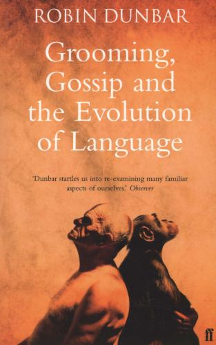

# Odd one out

Which of these is the odd one out?

* “I am literally dying of thirst”
* “Really, you need to watch out”

---

# Literally

* of or pertaining to alphabetic letters
* in a literal manner or sense; exactly.
* used for emphasis while not being literally true.

---

# Words on the move

* Verily ➠ Very
* True ➠ Truly
* Real ➠ Really

---

# Gliding through time

> ‘when a word means “true” and it’s used a lot, you can almost predict that, over time it will glide from meaning “truth” into meaning “very”. But the process can also go further than that, and that’s where **really** comes in’ — from ‘Words on the Move’

---

# Model Pragmatic Modifiers

* Factuality: “Really”, “Very”, “Literally”
* Acknowledgement of others’ state of mind: “Totally”, “we’re totally gonna get that contract”
* Counterexpectation: “Even”, “he didn’t even bring a present”
* Easing: “LOL”, “I like you. Im pretty sure everyone else figured that out before you lol”

---

# What does this mean for our usage?

* Does this mean I can’t tell anyone they are wrong anymore?

---

# What does this mean for our usage?

> “be conservative in what you do, be liberal in what you accept from others.” — [Postel’s Law](https://en.wikipedia.org/wiki/Robustness_principle)

---

# More on this …

* ["Words on the Move: Why English Won't - And Can't - Sit Still (Like, Literally)"](https://www.amazon.co.uk/Words-Move-English-Still-Literally/dp/1250143780)
* Covers everything mentioned here
* [Excerpt](https://www.thedailybeast.com/how-english-got-up-close-and-personal) also available

---

# More on this …

* ["Spell It Out: The singular story of English spelling"](https://www.amazon.co.uk/Spell-Out-singular-English-spelling/dp/1846685680) by David Crystal
* Cover History of English spelling. Whatever you may think makes sense … was likely an accident.
* If you are interested in straightforward explanations of language topics then anything by David Crystal is really good

---

# More on this …

* ["Grooming, Gossip and the Evolution of Language"](https://www.amazon.co.uk/Grooming-Gossip-Evolution-Language-Professor/dp/0571173977) by Robin Dunbar
* Speaking as “grooming”.
